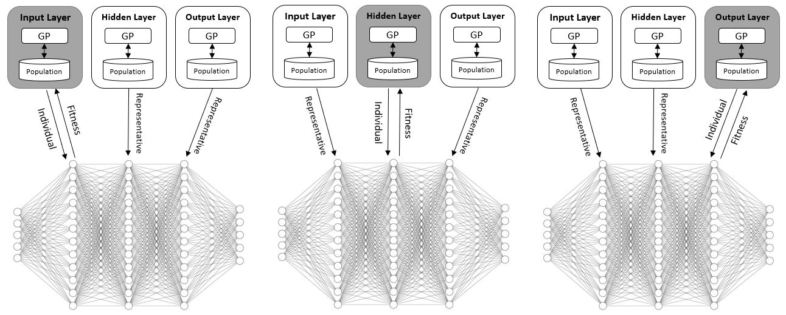

# Evolution of Activation Functions for Deep Learning Based Image Classification 

## This paper was submitted to GECCO's 2022 Workshop Neuroevolution at Work.

### Abstract:
Activation functions (AFs) play a pivotal role in the performance of  neural networks.
The Rectified Linear Unit (ReLU) is currently the most commonly used AF. Several replacements to ReLU have been suggested but improvements have proven inconsistent. Some AFs exhibit better performance for specific tasks, but it is hard to know a priori how to select the appropriate one(s). Studying both standard fully connected neural networks (FCNs) and convolutional neural networks (CNNs), we propose a novel, three-population, coevolutionary algorithm to evolve AFs, and compare it to four other methods, both evolutionary and non-evolutionary. 
Tested on four datasets---MNIST, FashionMNIST, KMNIST, and USPS---coevolution proves to be a performant algorithm for finding good AFs and AF architectures.

## Prerequisites

1. Python3 (>=3.6)

## Required Python Packages

1. pytorch >= 11.0
2. mlxtend
3. cartesian

## Executing the code
You can control all hyperparameters by providing it as argv to main.py:
1. --dir - result dir
2. --ds - dataset number (1=MNIST, 2=FashionMNIST, 3=KMNIST, 4=USPS)
3. --rep - number of replicates
4. --n_epochs - number of epochs for training
5. --n_baseline_af - baseline af (1=ReLU, 2=LeakyReLU)
6. --n_iter - number of iterations for search algorithms
7. --n_train1 - train1 set size (fraction)
8. --n_train2 - train2 set size (fraction)
9. --cnn - architecture - (--cnn for CNN and --no-cnn for FCN)

